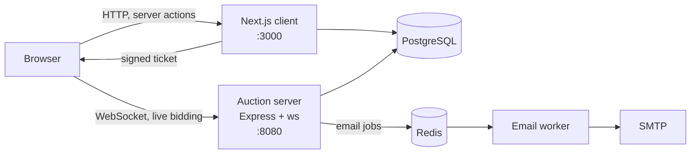

# BidRealm

[](https://github.com/rushikeshg25/BidRealm/actions/workflows/ci.yml)

BidRealm is a real-time auction platform. Sellers list lots with a start and end
time; buyers bid against a live clock and see every competing bid as it lands.
Auctions open and close on schedule on their own, and the outcome is emailed to
the winner and the seller.

https://github.com/user-attachments/assets/7d8cb7e4-a924-4222-9042-cbdb16295aae

## Contents

- [Architecture](#architecture)
- [How bidding works](#how-bidding-works)
- [WebSocket protocol](#websocket-protocol)
- [Data model](#data-model)
- [Repository layout](#repository-layout)
- [Getting started](#getting-started)
- [Environment variables](#environment-variables)
- [Commands](#commands)
- [Testing](#testing)
- [Continuous integration](#continuous-integration)
- [Design system](#design-system)
- [Contributing](#contributing)

## Architecture

Four processes and two datastores.



| Component | Directory | Responsibility |
| --- | --- | --- |
| Next.js client | `apps/client` | Pages, server actions, session handling, ticket minting |
| Auction server | `apps/server` | WebSocket connections, bid validation, auction lifecycle |
| Email worker | `apps/email-notification-server` | Drains the Redis queue and sends notifications |
| PostgreSQL | `packages/db` | Users, sessions, auctions, bids |
| Redis | n/a | Queue between the auction server and the email worker |

The client and the auction server share a database but never call each other
directly. The only coupling between them is `AUTH_SECRET`, which the client uses
to sign WebSocket tickets and the server uses to verify them.

Redis is optional. If it is not configured the auction server logs the fact and
carries on: bidding works, notifications are skipped. A bid must never fail
because the mail queue is down.

## How bidding works

Placing a bid is not a write the browser is allowed to make. The path is:

**1. The browser asks the Next app for a ticket.**

The auction server runs on a different origin, so the browser never sends it the
Lucia session cookie. Only the Next app can read that cookie, so only it can
vouch for who you are. `GET /api/ws-ticket?auctionId=...` returns a ticket that
is HMAC-SHA256 signed with `AUTH_SECRET`, scoped to a single auction, and valid
for 60 seconds.

**2. The browser opens a socket with that ticket.**

The server verifies the signature, the expiry and the auction scope. A
connection without a valid ticket is still accepted, as a spectator: it receives
every broadcast but any bid it sends is refused. That is what lets a signed-out
visitor watch a live auction.

**3. A bid is accepted, or refused with a reason.**

Every condition is checked and the price is moved inside one transaction:

```
auction exists
auction status is ACTIVE and now is within [startDate, endDate)
bidder is not the seller
amount is a positive whole number
amount >= minimumNextBid(currentPrice, startingPrice)

UPDATE auction SET currentPrice = :amount
 WHERE id = :id AND currentPrice < :amount     -- concurrency guard
INSERT INTO bid ...
```

The `currentPrice < :amount` predicate is what makes concurrent bids safe. Two
bids arriving together cannot both win: the loser matches no rows, the
transaction rolls back, and that bidder receives `BID_REJECTED` with reason
`OUTBID`. A late bid can never drag the price back down.

The bidder always gets an answer. Rejection reasons are `NOT_AUTHENTICATED`,
`AUCTION_NOT_FOUND`, `NOT_ACTIVE`, `OWN_AUCTION`, `INVALID_AMOUNT`, `TOO_LOW`
and `OUTBID`, each with a message written for the person reading it.

**4. Minimum bids follow a ladder.**

A rupee more on a thirty lakh car is not a bid, so the step grows with the
price. The rules live in `@repo/db/auction-rules` because the client needs them
to pre-fill and validate the form and the server needs them to enforce, and the
two must agree.

| Current price | Increment |
| --- | --- |
| below 1,000 | 10 |
| below 10,000 | 100 |
| below 1,00,000 | 500 |
| below 10,00,000 | 2,500 |
| 10,00,000 and above | 10,000 |

**5. Auctions open and close on their own.**

A sweep runs against the database every 15 seconds, independent of who is
connected, promoting lots past their start time to `ACTIVE` and settling lots
past their end time to `ENDED`. Settling resolves the winning bid, notifies
anyone watching, and queues the winner and seller emails. A second, one-second
ticker broadcasts the countdown to connected clients and closes a watched lot on
the exact second.

The sweep assumes a single server instance. Running more than one would need a
lock so that two processes cannot settle the same auction twice.

## WebSocket protocol

Connect to `ws://<host>:8080?auctionId=<id>&ticket=<ticket>`. The ticket is
optional; without it the connection is a spectator.

Client to server:

| Frame | Payload |
| --- | --- |
| `bid` | `{ type: "bid", amount: number }` |

Anything else is rejected. Frames are parsed through a zod schema, so malformed
JSON, unknown types, and non-integer, negative or infinite amounts are refused
before reaching the database.

Server to client:

| Frame | Meaning |
| --- | --- |
| `JOINED` | Initial state: status, current price, minimum bid, time left, whether you may bid |
| `TIME_LEFT` | Countdown tick, once per second |
| `BID` | Someone else bid |
| `BID_ACCEPTED` | Your bid was accepted |
| `BID_REJECTED` | Your bid was refused, with a reason and a message |
| `AUCTION_ENDED` | The lot closed, with the winner if there was one |
| `ERROR` | Connection-level problem |

The client ticks the countdown locally and uses `TIME_LEFT` to correct for
clock skew, so the display stays smooth under network jitter while remaining
correct on a machine whose clock is wrong.

## Data model

```
User 1---* Auction 1---* Bid *---1 User
User 1---* Session
```

- `Auction.status` is `INACTIVE`, `ACTIVE`, `ENDED` or `CANCELLED`.
- `Auction.category` is an enum: `ART`, `COLLECTABLES`, `ELECTRONICS`,
  `VEHICLES`, `WATCHES`, `FASHION`, `SHOES`, `MISCELLANEOUS`.
- Money is stored as whole rupees in `Int` columns throughout. An auction opens
  with `currentPrice` equal to `startingPrice`.
- Indexes cover the queries the app runs: the lifecycle sweep on
  `(status, startDate)` and `(status, endDate)`, listings on `category` and
  `createdAt`, the bid ledger on `(auctionId, createdAt)`, and bids by user.

## Repository layout

```
apps/
  client                      Next.js 14 app router front end
  server                      Express + ws auction server
  email-notification-server   Redis queue worker
packages/
  db                          Prisma schema, client, shared types, bidding rules
  ws-auth                     Signing and verification of WebSocket tickets
  env                         Per-service environment validation
  eslint-config               Shared ESLint configs
  typescript-config           Shared tsconfig bases
```

`@repo/ws-auth` holds both halves of the ticket scheme so signing and
verification cannot drift apart. `@repo/db/auction-rules` holds the bid ladder
for the same reason. `@repo/env` validates each service's environment at its
entry point, so a missing variable is a startup error naming the variable rather
than a confusing failure at the first request.

## Getting started

### Prerequisites

- Node.js 18 or later
- Yarn 1.x
- PostgreSQL
- Redis, optional, only for email notifications

### 1. Clone and install

```bash
git clone https://github.com/rushikeshg25/BidRealm-turbo.git
cd BidRealm-turbo
yarn
```

### 2. Configure the environment

Copy each `.env.example` to `.env` and fill it in:

```bash
cp packages/db/.env.example packages/db/.env
cp apps/client/.env.example apps/client/.env
cp apps/server/.env.example apps/server/.env
cp apps/email-notification-server/.env.example apps/email-notification-server/.env
```

Two of these matter more than the rest:

- `AUTH_SECRET` must be the **same value** in `apps/client` and `apps/server`.
  The client signs WebSocket tickets with it and the server verifies them, so if
  they differ nobody can bid. At least 16 characters.
- `NEXT_PUBLIC_WS_URL` needs its prefix. Next.js only inlines a variable into the
  browser bundle when it begins with `NEXT_PUBLIC_` and is accessed as a literal
  property. Without the prefix the value is `undefined` in the browser and the
  client silently falls back to `ws://localhost:8080`.

### 3. Set up the database

```bash
yarn --cwd packages/db prisma migrate dev
yarn --cwd packages/db db:generate
yarn --cwd packages/db db:seed      # optional sample lots
```

### 4. Run everything

```bash
yarn dev
```

| Service | URL |
| --- | --- |
| Client | http://localhost:3000 |
| Auction server | http://localhost:8080 |
| Health check | http://localhost:8080/health |

The email worker exits at startup if Redis is not configured. The other two
services do not depend on it.

## Environment variables

### `apps/client`

| Variable | Required | Notes |
| --- | --- | --- |
| `DATABASE_URL` | yes | PostgreSQL connection string |
| `AUTH_SECRET` | yes | Session signing and WebSocket ticket signing. Must match `apps/server` |
| `UPLOADTHING_TOKEN` | yes | UploadThing v7 token. Replaces the v6 `UPLOADTHING_SECRET` and `UPLOADTHING_APP_ID` pair |
| `NEXT_PUBLIC_WS_URL` | yes | WebSocket URL the browser connects to |

### `apps/server`

| Variable | Required | Notes |
| --- | --- | --- |
| `DATABASE_URL` | yes | Same database as the client |
| `AUTH_SECRET` | yes | Must match `apps/client` |
| `PORT` | no | Defaults to 8080 |
| `REDIS_HOST` | no | If unset, notifications are skipped |
| `REDIS_PORT` | no | Defaults to 6379 |
| `REDIS_PASSWORD` | no | |

### `apps/email-notification-server`

| Variable | Required | Notes |
| --- | --- | --- |
| `REDIS_HOST` | yes | Same instance the auction server publishes to |
| `REDIS_PORT` | no | Defaults to 6379 |
| `REDIS_PASSWORD` | no | |
| `SMTP_HOST` | no | Defaults to `smtp.ethereal.email` |
| `SMTP_PORT` | no | Defaults to 587 |
| `EMAIL_FROM` | yes | Sending address and SMTP username |
| `EMAIL_PASSWORD` | yes | SMTP password |

### `packages/db`

| Variable | Required | Notes |
| --- | --- | --- |
| `DATABASE_URL` | yes | Used by the Prisma CLI for migrations and seeding |

## Commands

Run from the repository root.

| Command | Description |
| --- | --- |
| `yarn dev` | Start every app in watch mode |
| `yarn build` | Build every app |
| `yarn lint` | ESLint across every workspace |
| `yarn turbo run typecheck` | TypeScript across every workspace |
| `yarn test` | Run the test suite once |
| `yarn test:watch` | Run the test suite in watch mode |
| `yarn format` | Format with Prettier |
| `yarn lint:dashes` | Fail if any em or en dash has crept into the repository |

Database commands run from `packages/db`:

| Command | Description |
| --- | --- |
| `yarn db:generate` | Regenerate the Prisma client |
| `yarn db:seed` | Load sample lots |
| `npx prisma migrate dev` | Create and apply a migration |
| `npx prisma migrate deploy` | Apply pending migrations |

## Testing

```bash
yarn test
```

109 tests, run with Vitest. Coverage is aimed at the rules where being wrong is
a security hole or a wrong number on screen rather than at line count:

| Area | What is covered |
| --- | --- |
| `packages/ws-auth` | Tampered payloads, foreign secrets, wrong auction, expiry, and malformed or absent tickets |
| `packages/db` | The increment ladder at every band boundary, and that the minimum always exceeds the current price |
| `apps/server` | Frame validation, every bid guard, and that the loser of a simultaneous-bid race is rejected rather than lowering the price |
| `apps/client` | Lakh and crore boundaries, countdown widths, pagination windowing, CSV escaping |

Tests live beside the code they cover, so a rule and its cases move together.

## Continuous integration

`.github/workflows/ci.yml` runs on every push to `master` and every pull
request, in two jobs.

**`quality`** runs lint, typecheck, test and build through Turborepo, with the
Yarn and Turbo caches warm. Installs use `--frozen-lockfile`, so a pull request
cannot quietly change dependencies.

**`database`** stands up PostgreSQL, applies the migration history to an empty
database, then diffs `schema.prisma` against that history. A schema edited
without a matching migration fails there rather than the next time somebody runs
`migrate dev`. It finishes by running the seed, which exercises the schema, the
enums and the generated client together.

## Design system

The interface is built around the two things that make a live auction different
from a catalogue: a price that moves and a clock that runs out.

Three colours carry meaning rather than decoration, and read the same way on a
card's edge rail, a status chip and the clock:

| Token | Meaning |
| --- | --- |
| `--paddle` | The only action colour and the only red in the app. If it is red, it costs something |
| `--live` | Bidding is open |
| `--brass` | The hammer has fallen |

Ordinary buttons stay ink, so the one red control on a page reads as the thing
to do. Bricolage Grotesque sets lot titles, Instrument Sans sets body text, and
IBM Plex Mono with tabular figures sets every price, countdown, lot reference
and ledger row, so a running clock does not shift the layout each second.

Motion is limited to two places: the hammer clock, which shifts from calm to
brass in the final hour and to paddle red in the final five minutes before
settling on a brass SOLD, and a single flash when a new bid moves the price.
Colour carries every state on its own, so `prefers-reduced-motion` loses no
information.

## Contributing

Contributions are welcome. Follow the getting started guide above, then:

1. Branch from `master`.
2. Keep `yarn lint`, `yarn turbo run typecheck` and `yarn test` green.
3. Add tests for anything that changes a bidding rule, a security boundary, or a
   displayed number.
4. If you change `schema.prisma`, generate a migration in the same commit. CI
   fails on drift between the two.
5. Use plain hyphens. Em and en dashes are not used anywhere in this repository,
   including comments and copy; `yarn lint:dashes` checks this and so does CI.
6. Open a pull request.

If BidRealm is useful to you, a star is appreciated.
